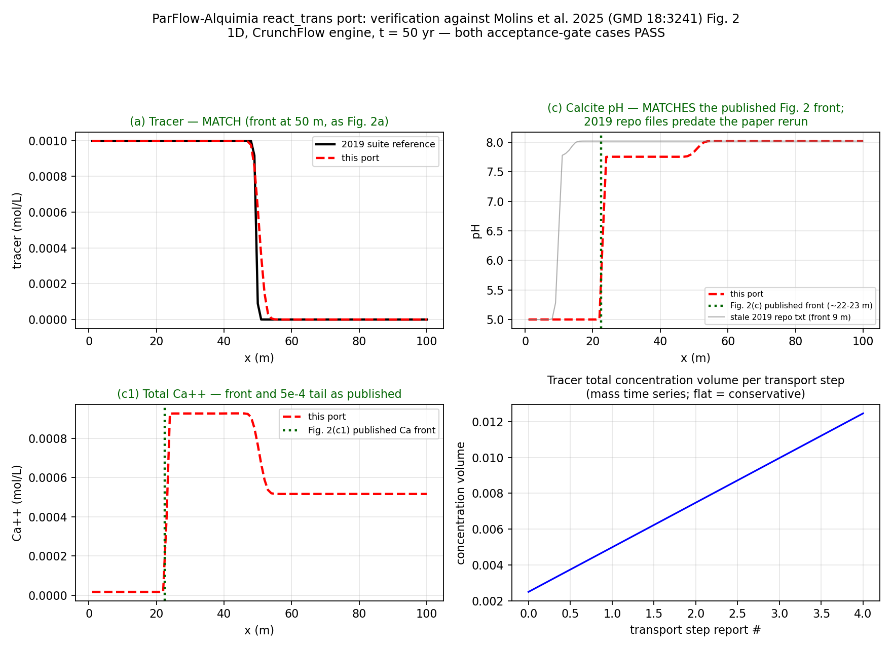
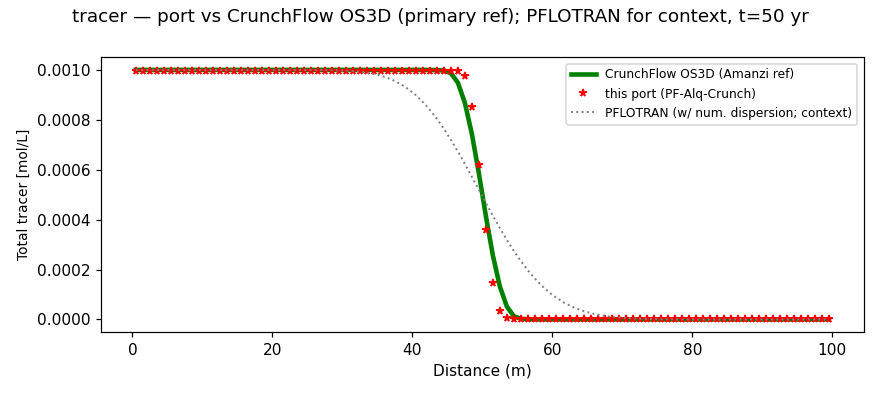
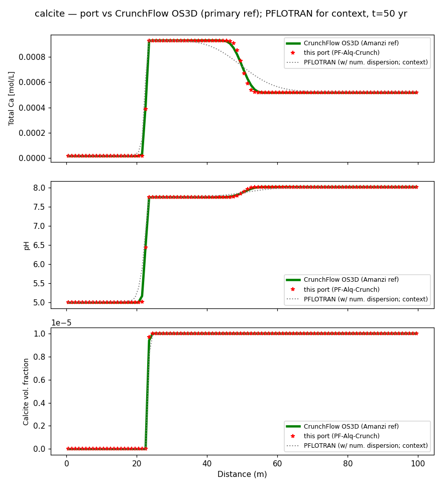
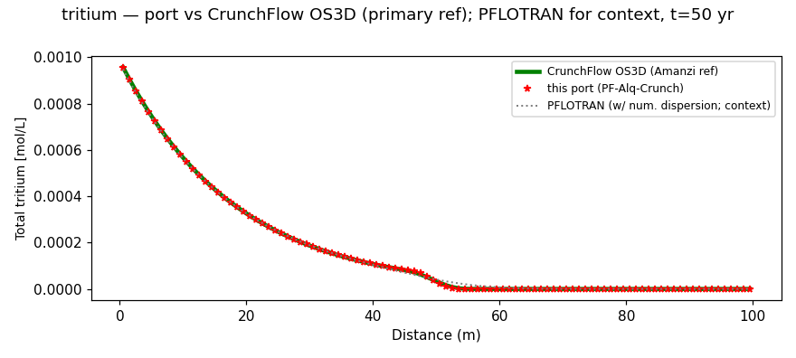
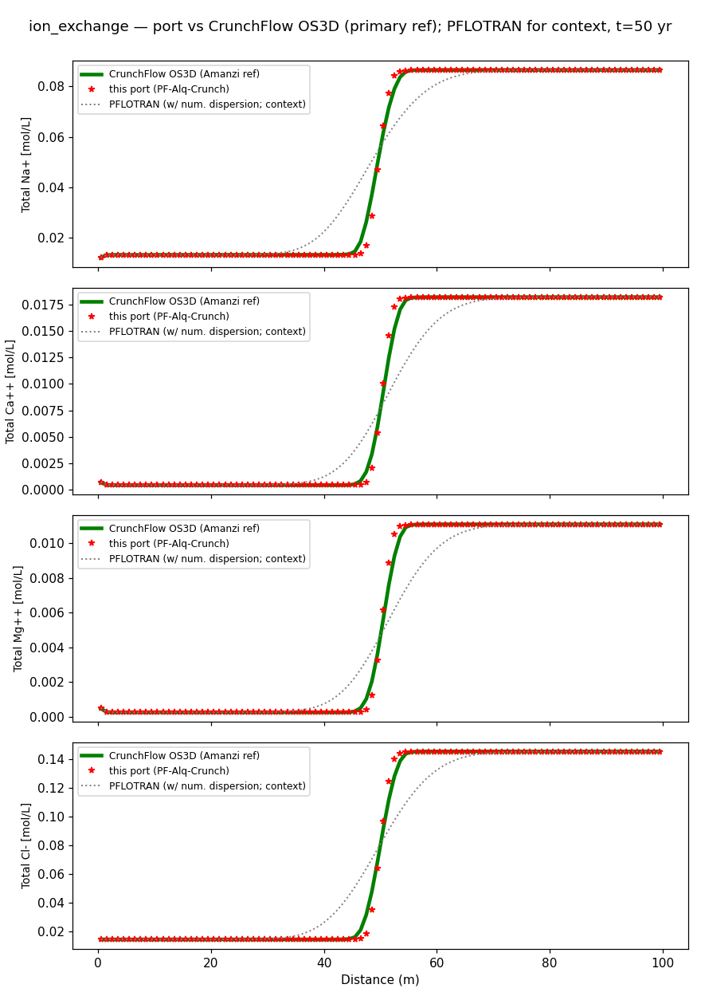
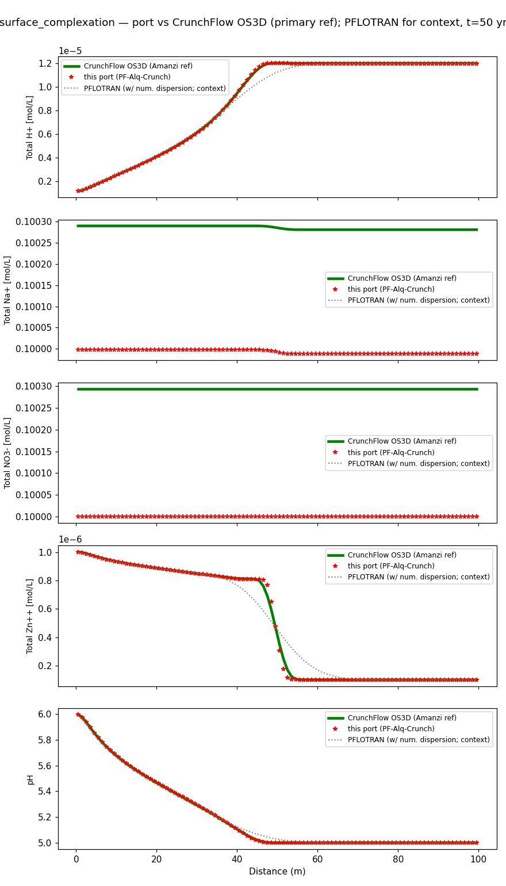
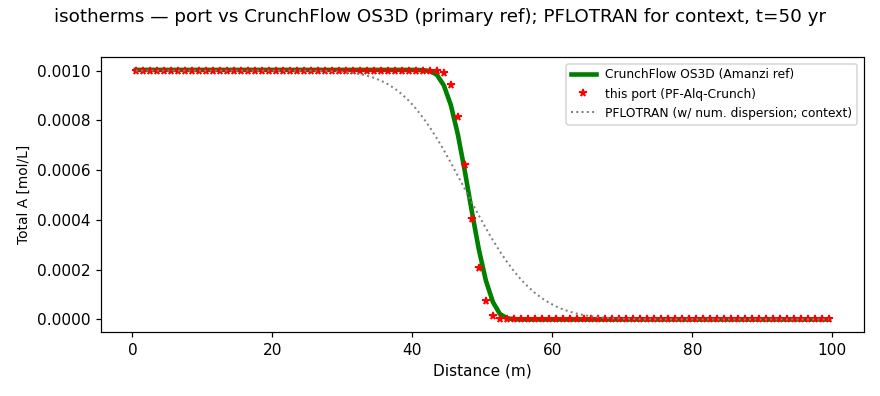

# ParFlow Reactive Transport (react_trans) — 1D Benchmark Verification

**Draft for review — Sergi Molins, Steve Smith**
**Date: 2026-06-13**

---

## 1. Summary

We have ported the reactive-transport coupling from the abandoned `react_trans`
branch onto current ParFlow `master`. The coupling wires ParFlow's solute
transport to a geochemical engine (here CrunchFlow) through the **Alquimia v1.0**
interface using explicit operator splitting; transport and chemistry both run on
CPU.

This report verifies **six 1D benchmark cases** — tracer, calcite dissolution,
tritium decay, ion exchange, surface complexation, and Kd isotherms — against the
references shipped with the Amanzi chemistry benchmarking suite:

1. **Molins et al. (2025, GMD 18:3241, Fig. 2).** The two acceptance-gate cases
   (tracer, calcite) reproduce the published profiles; the calcite front sits at
   ~23 m at 50 yr.
2. **CrunchFlow OS3D (primary reference).** Same geochemistry engine and same
   operator-split, TVD-advection scheme as the paper figures; PFLOTRAN is
   excluded from those figures because its transport is numerically dispersive.
   The port's front positions are within 0.22 m of OS3D on all fields (within
   0.05 m on most), and sorbed-species concentrations agree to ~0.1 %.
3. **PFLOTRAN (context).** The port agrees with Amanzi's PFLOTRAN solution to
   ~1 cell on reactive fronts and under a tenth of a cell on conservative
   species. Where the two references differ, PFLOTRAN is the broader of the two.

The ParFlow profiles are sharper than PFLOTRAN and match OS3D's sharpness. The
cause (§6) is that PFLOTRAN's transport includes molecular diffusion that neither
OS3D nor ParFlow's operator-split advection applies — a scheme difference, not a
coupling error.

---

## 2. The coupling, in brief

- **Operator splitting.** Each transport step advects the mobile solute field;
  the resulting per-cell concentrations are then handed to the engine, which
  advances geochemistry for the same Δt (`ReactionStepOperatorSplit`) and writes
  the updated state back. No reaction terms enter the transport operator.
- **Engine.** CrunchFlow via Alquimia's standard C interface
  (`CreateAlquimiaInterface`, the allocate/free/copy family, `ProcessCondition`,
  `ReactionStepOperatorSplit`, `GetAuxiliaryOutput`). The engine reads the native
  CrunchFlow input deck (`*.in`) and thermodynamic database (`*.dbs`) directly.
- **Transport.** Second-order Godunov advection with a min/max (non-oscillatory)
  limiter, advanced at the solver's CFL limit.
- **Scope (v1).** Transport on CPU, chemistry on CPU, per-cell solve. GPU is out
  of scope for v1 (a configure-time guard forbids Alquimia + CUDA/Kokkos).
- **Default-off.** `Solver.Chemistry = None` by default; with chemistry off the
  code path is behavior-identical to master (full suite passes with zero
  baseline diffs).

Engine stack used for these runs: OpenMPI 4.1.6 → PETSc 3.20.0 → CrunchTope-dev
→ alquimia-dev, built from source (reproducible script captured for the
Princeton cluster).

---

## 3. Benchmark problems

All six cases use the **same CrunchFlow decks as the Amanzi/Molins benchmark**
(`1d-*-crunch.in` + `.dbs`), so the geochemistry is identical to the reference by
construction; only the flow-and-transport host (ParFlow) differs. They share one
flow/grid setup:

| Property | Value |
|---|---|
| Domain | 100 m × 1 × 1, single layer |
| Grid | NX = 100, ΔX = 1 m |
| Flow | Darcy, fixed-head inlet (left) / outlet (right), no-flow sides |
| Effective transport velocity | ~1 m/yr (tracer front reaches 50 m at 50 yr) |
| Simulated time | 50 yr, output every 10 yr (5 dumps) |
| Advection | 2nd-order Godunov + min/max limiter |

The six cases progressively exercise more of the coupling:

- **Tracer** — conservative solute, pure advection. Tests the transport host in
  isolation.
- **Calcite dissolution** — inlet solution undersaturated with calcite dissolves
  the mineral at the advancing front, raising pH and aqueous Ca (kinetic,
  transition-state-theory rate). Full transport-chemistry coupling.
- **Tritium decay** — single mobile species with first-order aqueous-kinetic
  decay (+ daughter). Tests an aqueous kinetic reaction.
- **Ion exchange** — Na+/Ca++/Mg++/Cl- with cation exchange; chromatographic
  separation of the exchanging cations. First case with **sorbed-species output**
  (`PrimarySorbed`).
- **Surface complexation** — H+/Na+/NO3-/Zn++ with pH-dependent Zn sorption onto
  ferrihydrite surface sites. Sorbed species + surface-site densities + pH.
- **Isotherms** — a sorbing species under a Kd (linear) isotherm; mobile + sorbed.

The four added cases reuse jbeisman's ParFlow drivers from the
`PF-Alquimia_verification` suite, adapted to the current key conventions
(`Solver.Chemistry Alquimia`, etc.) exactly as the calcite/tracer cases were.

---

## 4. Acceptance gate — vs Molins et al. (2025) Fig. 2

The port reproduces the published Fig. 2 profiles at 50 yr:

- **Tracer:** front at 50 m (v·t), matching the published tracer panel.
- **Calcite:** reaction front at ~22–23 m, matching the published Ca, pH, and
  calcite-volume-fraction profiles.



*Note on stale references:* the 2019 verification-repo `.txt` files that ship
alongside the original branch place the calcite front near 9 m — those are
**pre-publication output** and disagree with the published figure. The published
2025 figure shows ~22–23 m, which the port matches; an engine-only
`TransportDriver` run on our engine build independently confirms the front
position, so the offset is the (older) reference files, not the coupling.

---

## 5. Independent cross-check — vs CrunchFlow OS3D (primary) and PFLOTRAN

To move beyond regression-against-self, we compared the port against the
independent references Amanzi ships for the identical decks
(`test_suites/benchmarking/chemistry/*_1d`). The **primary reference is
CrunchFlow OS3D** (`crunchflow/os3d/*.out`):

- It is the most direct possible reference — the **same geochemistry engine and
  the same operator-split scheme** as our port (which couples to CrunchTope
  through Alquimia), differing only in the transport host.
- OS3D uses a **TVD advection scheme** that does not carry the numerical
  dispersion of PFLOTRAN's transport. This is the documented reason the Molins et
  al. (2025) paper figures show the CrunchFlow OS3D results and **not** PFLOTRAN
  (per Sergi Molins; the choice was made with Glenn Hammond). We therefore lead
  with OS3D and show **PFLOTRAN only for context** — its broader fronts are a
  property of its transport solver, not a discrepancy to be explained away.

Units: OS3D `totcon` outputs are **molality (mol/kgw)**, as the file headers
state; PFLOTRAN and the port are **molarity (mol/L)**. For dilute reactive species
the difference is within line width, but on the ~0.1 M conservative background
ions (Na+, NO3-, Cl-) it appears as a *uniform* ~0.3 % offset — the
molality-vs-molarity convention, **not** a model discrepancy (verified:
OS3D/PFLOTRAN = OS3D/port = 1.0029 identically across those ions, while
port/PFLOTRAN = 1.0000). Front position, the headline metric below, is
unit-invariant.

### Quantitative agreement, mobile species + pH (t = 50 yr)

Front positions (half-level crossing, m). Headline = **port vs OS3D**; PFLOTRAN
shown for context. The RMS column is a like-for-like (mol/L) shape check of
port vs PFLOTRAN.

| Case | Field | OS3D | **port** | port−OS3D | PFLOTRAN (context) | RMS vs PFLO |
|---|---|---|---|---|---|---|
| Tracer | tracer | 50.00 | 49.96 | **−0.04** | 49.87 | 10.4 % |
| Calcite | Ca | 22.62 | 22.66 | **+0.04** | 22.17 | 5.6 % |
| Calcite | pH | 22.52 | 22.56 | **+0.04** | 22.13 | 3.7 % |
| Calcite | Calcite vol. frac. | 23.03 | 23.02 | **−0.01** | 23.11 | 1.5 % |
| Tritium | tritium | 13.03 | 13.02 | **−0.02** | 13.18 | 0.7 % |
| Ion exchange | Na+ | 49.48 | 49.64 | **+0.15** | 48.19 | 10.6 % |
| Ion exchange | Ca++ | 50.53 | 50.34 | **−0.20** | 51.65 | 10.3 % |
| Ion exchange | Mg++ | 50.53 | 50.34 | **−0.20** | 51.65 | 10.3 % |
| Ion exchange | Cl- (conservative) | 50.00 | 49.98 | **−0.02** | 49.87 | 10.3 % |
| Surf. complexation | H+ | 31.84 | 31.97 | **+0.13** | 31.23 | 3.3 % |
| Surf. complexation | Na+ | 50.00 | 49.98 | **−0.02** | 49.87 | 10.3 % |
| Surf. complexation | Zn++ (sorbing) | 48.85 | 49.07 | **+0.22** | 47.51 | 7.9 % |
| Surf. complexation | pH | 18.29 | 18.37 | **+0.09** | 17.76 | 1.7 % |
| Isotherms | A | 48.08 | 48.06 | **−0.02** | 47.94 | 9.7 % |

Reading the table:

- The port's front positions are within 0.22 m of OS3D on every field and within
  0.05 m on most — within one grid cell of the operator-split CrunchFlow solution
  the paper reports.
- Where the two references differ (e.g. ion-exchange Ca++: OS3D 50.53, port
  50.34, PFLOTRAN 51.65), the port tracks OS3D and PFLOTRAN is ~1.3 m broader —
  the TVD-vs-dispersive transport difference (§6).
- Conservative species (Cl- in ion exchange, Na+ in surface complexation) advect
  without reacting and land within ~0.02 m of the OS3D tracer front, which checks
  the transport host.
- Plateau concentrations and sorbed amounts match to within line width, so the
  equilibria agree, not only the front positions.

### Sorbed species — units check

The PFLOTRAN sorbed datasets are in mol/m^3-bulk. We checked that the port's
`PrimarySorbed` output uses the same units: ion-exchange sorbed Na+ ranges
115.2–160.6 mol/m^3 in the port vs 113.6–160.8 in PFLOTRAN, agreeing in absolute
value to ~0.1 %. The sorbed-species path (new in these four cases) is therefore
verified quantitatively, not only by shape.

### Figures (CrunchFlow OS3D = green line [primary ref]; port = red stars; PFLOTRAN = grey dotted [context])








The red port stars sit on the green OS3D reference line throughout; the grey
dotted PFLOTRAN curve is visibly broader at every front — the TVD-vs-dispersive
transport difference (§6). In the surface-complexation Na+ and NO3- panels the
OS3D line sits a uniform ~0.3 % above the port stars: that is the molality
(mol/kgw) vs molarity (mol/L) convention noted above (those background ions are
otherwise flat, so the y-axis auto-zooms onto the 0.3 % band), not a discrepancy.

---

## 6. Discussion — why the ParFlow fronts are sharper

Across the cases the ParFlow profiles are sharper than the PFLOTRAN reference —
clearest in the tracer, the ion-exchange fronts, and the calcite Ca "shoulder."
The cause is concrete:

- The CrunchFlow decks specify **`fix_diffusion 1.E-09` m^2/s** (with
  `dispersivity 0.0`). The PFLOTRAN reference solves transport **with** that
  molecular diffusion, which spreads the fronts.
- In the operator-split coupling, **ParFlow does the transport** — second-order
  Godunov advection, with the engine doing chemistry only
  (`ReactionStepOperatorSplit`). ParFlow's solute advection applies **no
  diffusion/dispersion term**, so its fronts stay near the analytic
  Courant-1 step.

- The **CrunchFlow OS3D** reference confirms this. OS3D is the same operator-split
  engine family, and its fronts are sharp like ParFlow's rather than diffuse like
  PFLOTRAN's (green line vs grey dotted in the figures); the port and OS3D agree
  on front position to within ~0.2 m across all cases (table above). The sharpness
  tracks the transport treatment, not the geochemistry or the coupling.

The width difference is therefore a modeling difference (advection-only vs
advection+diffusion), localized to the front. The front positions agree to ~1
cell vs PFLOTRAN and to within ~0.2 m vs the same-engine OS3D reference, and
conservative species match the tracer. The port's tracer front is also consistent
with the Molins et al. (2025) tracer panel the baselines reproduce (§4).

**Open question for Sergi / the team:** if a like-for-like front *width*
comparison is wanted, ParFlow transport would need a molecular-diffusion /
dispersion term in the advected-solute step (it has none today). Whether that is
worth adding for v1 — versus documenting the advection-only assumption — is a
design call. It does not affect the chemistry verification: equilibria, plateau
concentrations, sorbed amounts, and front positions all agree.

---

## 7. Proposed testing architecture (two tiers)

We suggest separating two things that have different purposes, dependencies, and
cadence — and that probably belong in different places. **Input welcome on
where each lives and how large the CTest footprint should be.**

| | **Tier 1 — CTest regression** | **Tier 2 — benchmark verification** |
|---|---|---|
| Question | "did output change vs last known-good?" | "does the port match an independent code / the paper?" |
| Reference | the port's own `correct_output` baselines | PFLOTRAN / Amanzi + Molins (2025) |
| Lives in | the ParFlow repo | likely **outside** the PF repo |
| Deps | ParFlow + Alquimia engine | + h5py, matplotlib, ~tens of MB of Amanzi reference data |
| Cadence | every build/CI | occasional (release, or to produce a report like this) |
| Footprint | must stay lean | can be as extensive as useful |

- **Tier 1** is the lightweight per-case regression test, gated behind
  `PARFLOW_HAVE_ALQUIMIA` so it only runs in an Alquimia-enabled build. Calcite
  and tracer are committed today (TCL + Python). Open question for Steve: do all
  six cases belong in CTest, or a representative subset?
- **Tier 2** is this cross-check + report + the bulky reference data. The natural
  home is jbeisman's `PF-Alquimia_verification` repo (or a successor) — it
  already holds the drivers and reference data, and it keeps heavy deps out of
  the PF repo. This mirrors how Amanzi separates its benchmarking suite from its
  unit/regression tests.

Note these are *different by construction*: the cross-check in this report
(Tier 2, vs PFLOTRAN) is **not** a CTest, and the CTest regression tests
(Tier 1, vs our own baselines) are not the cross-check.

### Current integration status

- **Committed to the PF repo (Tier 1):** calcite + tracer as TCL
  (`test/chemistry/`) and Python (`test/python/chemistry/`), wired into CTest
  behind `PARFLOW_HAVE_ALQUIMIA`; both key-validate and run green. The chemistry
  input keys are defined in pf-keys (so they validate in the Python tools). A
  narrative reactive-transport section has been added to the user manual; the
  per-key reference entries in the manual are still to be written.
- **Generated for this report (candidate Tier 1 / Tier 2):** the four added
  cases run ON end-to-end and emit mobile **and sorbed** output; their baselines
  and cross-checks are produced but **not yet committed** — pending the
  placement decision above.

### Proposed Tier-2 suite layout

Per Sergi's suggestion, Tier 2 should be a standalone, published benchmark suite
in the spirit of Amanzi's and ATS's — demonstrating cross-code integration, not
just self-regression. The natural home is jbeisman's `PF-Alquimia_verification`
repo (which already holds the drivers and the bulk of the reference data). A
proposed structure:

```
PF-Alquimia_verification/
  README.md                     # what each case verifies, how to run, env/deps
  environment.yml               # h5py, matplotlib, numpy, parflow pftools
  references/                   # independent reference data (vendored or submodule)
    amanzi/                     # sparse subtree: benchmarking/chemistry/*_1d
    molins2025/                 # published Fig. 2 digitized profiles
  cases/
    calcite/  tracer/  tritium/  ion_exchange/  surface_complexation/  isotherms/
      run.py                    # build deck via the ParFlow Python Run API, run ON
      chemistry.in / *.dbs      # CrunchFlow engine deck
      expected/                 # port output committed as the case's record
  compare/
    compare_os3d.py             # port vs OS3D (primary) + PFLOTRAN (context)
    gate_fig2.py                # acceptance gate vs Molins (2025) Fig. 2
  results/                      # generated: *_threeway.png, summaries, this report
  .github/workflows/verify.yml  # optional: nightly/release run on a box with the engine
```

Design notes:

- **Primary reference is CrunchFlow OS3D**, with PFLOTRAN retained as labelled
  context — matching the paper's own choice and this report's framing.
- **Reference data is vendored** (the Amanzi sparse subtree + digitized Fig. 2)
  so the suite is reproducible without re-deriving references; this is the
  ~tens-of-MB that must stay out of the ParFlow repo.
- **One driver per case** uses the ParFlow Python Run API (TCL is deprecating),
  reusing the same decks as the Tier-1 CTest so the two tiers cannot drift.
- **Decoupled cadence:** runs at release or on demand to regenerate the report,
  on a machine with the Alquimia/CrunchTope engine available — not on every PF CI
  build. The scripts in this report's `verification-runs/` are the working
  prototype of `compare/` and `cases/` and can be lifted in directly.

---

## 8. How to

### 8.1 Build ParFlow with chemistry

Full instructions are in `docs/react_trans_build_howto.md`. In short: build the
geochemistry engine chain (OpenMPI 4.1.6 → PETSc 3.20 → CrunchTope → alquimia-dev)
and the MPI-matched TPLs once, then configure ParFlow ON:

```sh
cmake -Bbuild-on -DPARFLOW_ENABLE_ALQUIMIA=ON \
  -DPARFLOW_ALQUIMIA_ROOT=<engine prefix> -DHYPRE_ROOT=... -DNETCDF_DIR=... -DHDF5_ROOT=...
cd build-on && make -j8 install
```

ParFlow locates Alquimia (and CrunchTope/PETSc behind it) via `find_package` +
`*_ROOT` hints — there is no in-build TPL download. The chemistry tests register
only in an Alquimia-enabled build.

### 8.2 Run one case

```sh
# subsettools env (h5py + parflow.read_pfb); PARFLOW_DIR must point at install-on
python verification-runs/cases/run_case.py {tritium|ion_exchange|surface_complexation|isotherms}
# output PFBs land in verification-runs/cases/<case>/out/
```

Calcite and tracer run from the committed tests instead
(`test/chemistry/` TCL, `test/python/chemistry/` Python).

### 8.3 Reproduce the cross-check and figures

```sh
# Primary cross-check: port vs CrunchFlow OS3D (+ PFLOTRAN for context)
python verification-runs/amanzi-crosscheck/compare_os3d.py
# -> <case>_threeway.png (x6) + threeway_summary.txt
# (compare_all.py is the older port-vs-PFLOTRAN-only variant.)
```

Reference data is a sparse checkout of
`amanzi/amanzi:test_suites/benchmarking/chemistry` (PFLOTRAN `.h5` +
CrunchFlow OS3D `.out`). "Ours" is `test/chemistry/correct_output/` for
calcite/tracer and `verification-runs/cases/<case>/out/` for the four added cases.

### 8.4 Add a new case

1. Drop the CrunchFlow deck (`*.in` + `.dbs`) and a ParFlow driver under
   `verification-runs/cases/<case>/`, following an existing case.
2. Add the case to the `CASES` dict in `run_case.py` and run it ON.
3. Add the field → reference mapping to `CFG` in `compare_os3d.py` (PFLOTRAN
   dataset name, OS3D file/column, our PFB field), then re-run §8.3.

---

## 9. Status and next steps

- **Done:** all branch physics ported; chemistry-off path behavior-identical to
  master; ON build runs reactive transport end-to-end; acceptance gate passed
  (calcite + tracer vs Molins 2025); calcite + tracer committed as TCL and Python
  tests; **all six benchmark cases run ON and cross-checked against the
  CrunchFlow OS3D reference (primary) and PFLOTRAN (context) from the Amanzi
  suite (this report), including verified sorbed-species output.**
- **Decisions wanted:** (1) where the Tier-2 benchmark suite lives; (2) how many
  cases belong in the Tier-1 CTest footprint; (3) whether to add a
  diffusion/dispersion term to ParFlow solute transport for like-for-like front
  *widths*, or document the advection-only assumption.
- **Next:** commit the four added cases (Tier 1) and land the Tier-2 suite once
  the above are settled; chemistry manual prose; maintainer-review polish series
  (solver-block dedup, move `chem_*` into a `chemistry/` directory, rename
  `advect_new.F90`, doxygen, compile-as-C++).

*Figures in `figures/`. Questions / corrections welcome — this is a draft.*
